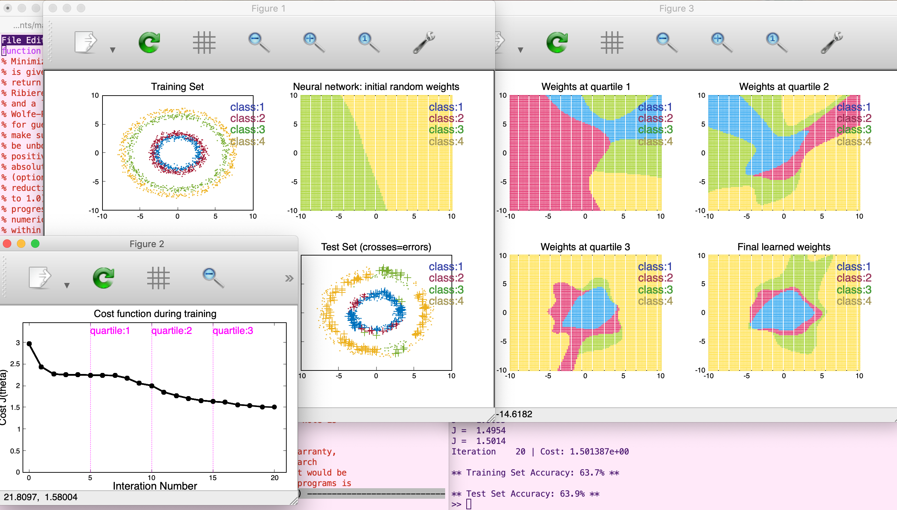
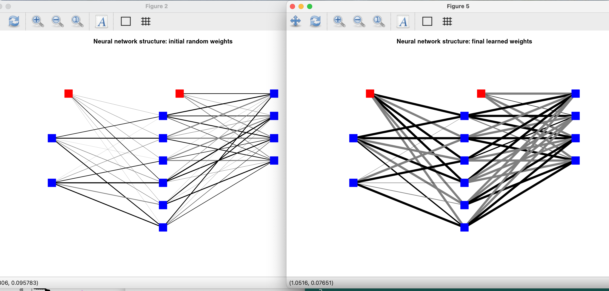

# VNN (Octave/MATLAB)

Visualise the learning of a toy neural neural network on
multidimensional data.

Run with command `>> vnn` on MATLAB/Octave command prompt.

Run with command `>> debug_showNetwork` to play around with just
setting up a neural network with random weights.

Neural network/backpropagation/optimisation code comes from Andrew
Ng's Coursera ML course
https://www.coursera.org/learn/machine-learning

Generation and visualisation of cluster and sphere datasets from
distributions, and visualisation of cost function and neural network
structure and filters during and after learning, are my own work.

Inspiration taken from TensorFlow Neural Network Playground
https://playground.tensorflow.org/

# Current functionality

-- vnn: Script to upload a cluster or spherical dataset and view it;
   set random weights to the neural network and visualise the intial
   network state; train the neural network on the data; view neural
   network performance on training and test datasets and visualise
   final categorisation of dataset space.

-- Currently, only 2D data can be visualised (although nD data can be
   learned for any n>1).

-- Currently, only a neural network with 3 layers can be specified and
   visualised.

# Functionality to add

-- Implement user input validation to ensure suitable parameters are
   used for network structure and training. 

-- Change training snapshots to occur at early points in training,
   instead of quartiles.

-- Implement user choice for uploading saved dataset or generating new
   dataset (via menu interface)

-- Make neural network structure (no. of hidden layers, number of
   units in each layer) flexible and selected by user

-- Visualise low-res filters of units in neural network structure

DONE(220612)-- Visualise final neural network structure and weights
   for 2D data training.

DONE(220612)-- Implement user choice of number of units in the hidden
   layer, with immediate visualistion of randomly initialised weights.

-- Add visualisation of cost function on Test Set data during training
   (to fmincgv.m)

-- Make figure sizes relative to user screen size rather than fixed.

DONE(220612)-- Add neural network % performance to subplot titles for
   final Training Set and Test Set visualisations (to vnn1.m)

-- Visualisation of neural network filters and structure for nD data,
   n >= 3. Possible 3D scatter plots?

-- More dataset distribution shapes, including "ribbons"

-- Implement validation step(s) between training and testing

# Known bugs

-- Tested only on OS X (MacBook Pro). On other systms, line thickness
   may be too large in network figures.

-- On older OS X systems, such as Mojave 10.14.6 and earlier, when
   using Octave with GNUPLOT qt, 3D scatter plot background is black
   by default and must be changed to white manually by user at the
   start of the backpropagation learning process to improve
   visualisation.

