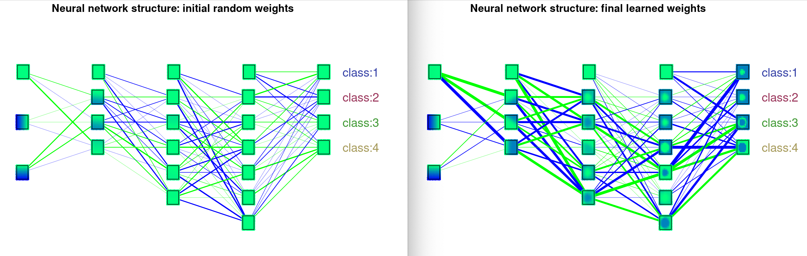
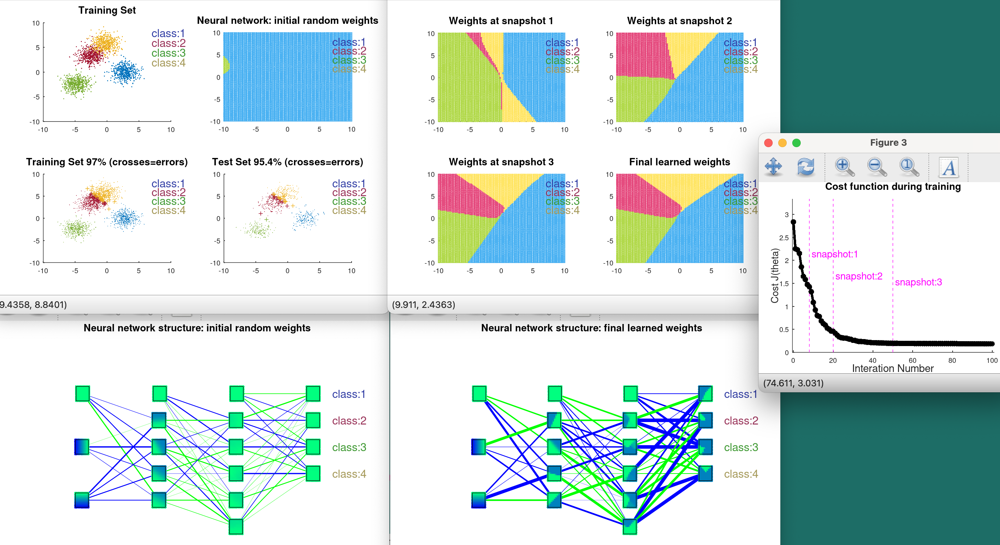
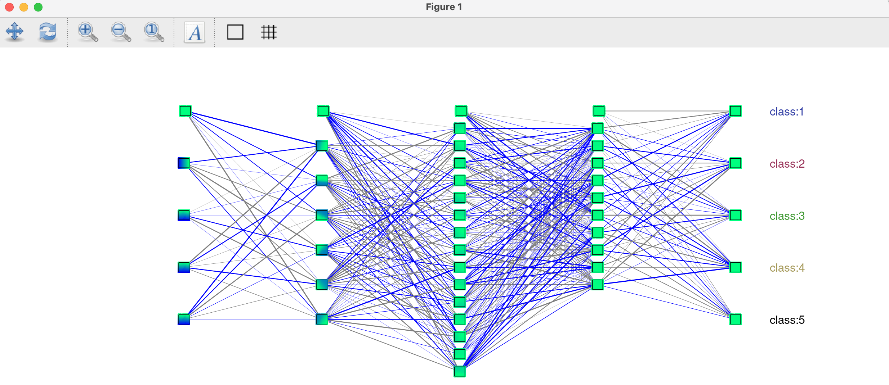

# VNN (Octave/MATLAB)

Visualise the learning of a neural network.

Based on the backpropagation and optimisation code for a feedfoward
network (multilayer perceptron, batch gradient descent) from the 2021
Octave/MATLAB iteration of Andrew Ng's Coursera ML course
https://www.coursera.org/learn/machine-learning

The...

* generalisation of the cost function and backpropagation algorithms to work with an arbitrary number of hidden layers,
* generation and visualisation of cluster and sphere datasets,
* visualisation of cost function during learning, and
* visualisation of neural network structure, unit filters, and
* categorisation of dataset space before and after learning

... are all my own work.

Inspiration taken from TensorFlow Neural Network Playground
https://playground.tensorflow.org/

# Current functionality

Run with command `>> vnn` on MATLAB/Octave command prompt to:

* upload or generate a cluster or spherical dataset and view it
* select number of hidden layers and units in the neural network
* set random weights to the neural network edges and view the initial network state and categorisation of dataset space
* train the neural network on the dataset
* view neural network performance during training
* visualise final network state and categorisation of dataset space based on learned weights
* view network performance on training data and test data after learning

Run with command `>> debug_showNetwork` to play around with setting up
a neural network with random weights:

# Future functionality ideas

DONE(220725)-- Generalise backpropagation algorithm to work for neural networks
   with any number of layers

DONE(220702)-- Visualise feature filters of individual units in neural
   network structure

DONE(220701) -- Make neural network structure (no. of hidden layers,
   number of units in each inner layer) flexible and selectable by
   user

DONE(220701)-- Implement user input validation to ensure suitable
   parameters are used for network and training properties

DONE(220701)-- Change training snapshots to occur at earlier points in
   training, instead of quartiles.

DONE(220701)-- Implement user choice for uploading a saved dataset or
   generating new dataset (via menu interface)

DONE(220612)-- Visualise final neural network structure and weights
   for 2D data training.

DONE(220612)-- Implement user choice of number of units in the hidden
   layer, with immediate visualistion of randomly initialised weights.

DONE(220612)-- Add neural network % performance to subplot titles for
   final Training Set and Test Set visualisations (to vnn1.m)

-- Add visualisation of cost function on Test Set data during training
   (to fmincgv.m)

-- Make figure sizes relative to screen size rather than fixed.

-- Visualisation of neural network filters and structure for nD data,
   n >= 3. Possible 3D scatter plots?

-- More dataset distribution shapes, including "ribbons"

-- Implement validation step(s) between training and testing

# Known issues

-- Tested only on OS X 11.6 (MacBook Pro). On some other systems,
   figure lines are rendered too thickly.
   

-- On older OS X systems, such as Mojave 10.14.6 and earlier, when
   using Octave with GNUPLOT qt, figure backgrounds are black by
   default and must be changed to white manually by user at the start
   of the backpropagation learning process to improve visualisation.

